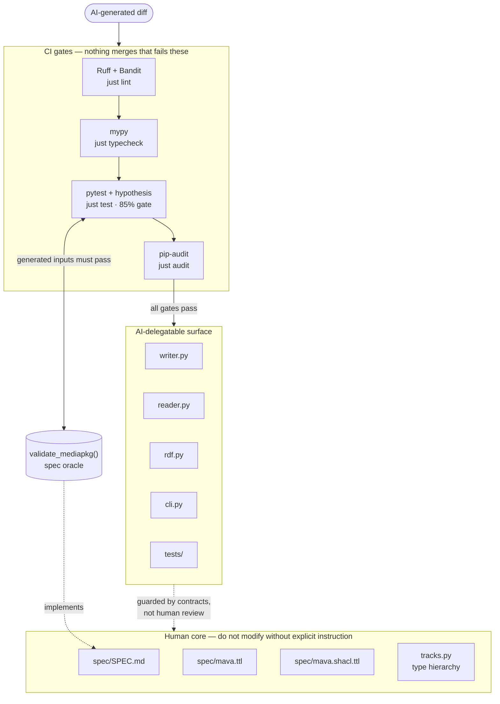
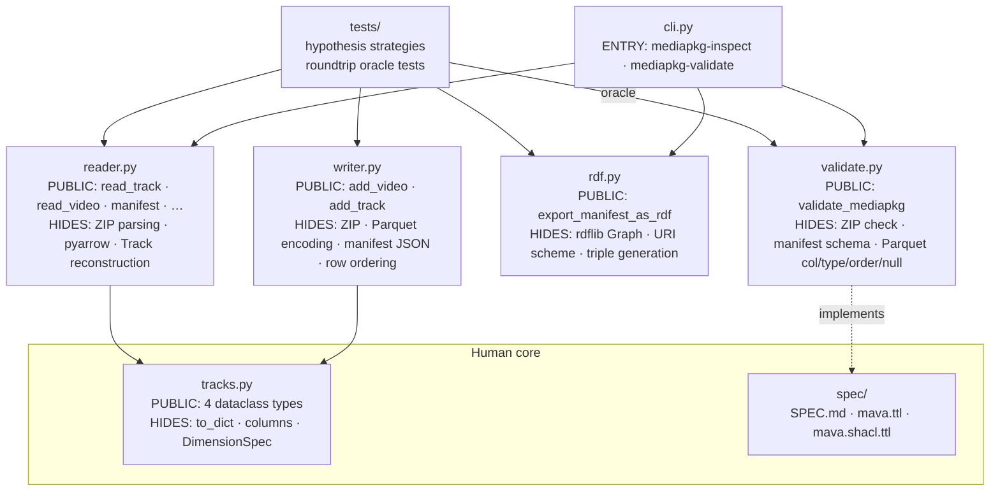

# AI-Readiness Case Study

This document records the state of the repo before and after a deliberate effort
to make it safe for AI-assisted contribution. It is a snapshot in time, not
living documentation — the ongoing rules of engagement for AI contributors live
in [CLAUDE.md](CLAUDE.md).

---

## 1. Initial state

### What was already there

`mava-exchange` was unusually well-positioned compared to most repos. The
foundations that matter most for AI-readiness were already present:

| Layer                      | What existed                                                                                                                                                        |
| -------------------------- | ------------------------------------------------------------------------------------------------------------------------------------------------------------------- |
| **Modularization**         | Clean module boundaries: `tracks.py` (types), `writer.py`, `reader.py`, `validate.py`, `cli.py`. Real interfaces you can guard.                                     |
| **Interface contracts**    | A formal RFC 2119 spec (`spec/SPEC.md`), an RDF ontology (`spec/mava.ttl`), and SHACL constraint shapes (`spec/mava.shacl.ttl`). Most repos don't have any of this. |
| **Programming guidelines** | Ruff linting, treefmt formatting, pre-commit hooks, CI format gate. Fully enforced.                                                                                 |
| **Documentation**          | Sphinx + pyLODE auto-build, deployed to GitHub Pages on merge.                                                                                                      |
| **Testing**                | 1363 LOC of pytest tests across 7 files. All passing.                                                                                                               |
| **CI/CD**                  | GitHub Actions: lint, build, test, format on every PR.                                                                                                              |

### What was missing

The spec existed as documentation. It wasn't doing guard duty.

| Gap                    | Why it matters                                                                                                                                                     |
| ---------------------- | ------------------------------------------------------------------------------------------------------------------------------------------------------------------ |
| No coverage gate       | Tests existed but nothing stopped someone from deleting half of them. `just test` would still pass.                                                                |
| No type checking in CI | Type hints were present throughout but `mypy` wasn't running anywhere.                                                                                             |
| No security scan       | No `pip-audit`, no vulnerability gate. Dependency security was unverified.                                                                                         |
| Spec not executable    | `spec/SPEC.md` and `spec/mava.shacl.ttl` were documentation. `validate_mediapkg()` was the real validator, but no tests used it as an oracle for generated inputs. |
| No `CLAUDE.md`         | AI assistants working in the repo had no map: what can I change, what must I not touch, how do I add a new track type safely?                                      |

The net effect: human review was carrying the full safety load. Coders had to
read every diff. That doesn't scale once AI starts generating diffs.

---

## 2. What changed

### Phase 1 — Declare the human core

**Files created:** `CLAUDE.md`, `.claude/` directory

The first thing an AI assistant reads when it opens this repo. It maps:

- **Human core** (do not modify without explicit instruction): `spec/SPEC.md`,
  `spec/mava.ttl`, `spec/mava.shacl.ttl`, the type hierarchy in `tracks.py`
- **AI-delegatable surface**: `writer.py`, `reader.py`, `cli.py`, `tests/`,
  `docs/`

Without this, every AI interaction starts from scratch. With it, the AI knows
the rules of engagement before it touches anything.

### Phase 2 — Harden the guard layers

**Files modified:** `pyproject.toml`, `justfile`,
`.github/workflows/normal.yaml`

Four sub-changes, all in CI infrastructure:

**2a — Coverage gate** Added `pytest-cov` and set `fail_under = 85` in
`[tool.coverage.report]`. `just test` now fails if coverage drops below 85%. "We
have tests" became "tests are a contract."

**2b — Type checking** Added `mypy` with `ignore_missing_imports = true`
(pandas/pyarrow ship without stubs). A new `typecheck` job runs on every PR.
mypy immediately found 5 real pre-existing type errors in `reader.py` and
`tracks.py` — fixed as part of this phase. This is a useful demo of what happens
when you turn on a guard against existing code.

**2c — Security scan** Added `pip-audit` as a new `audit` job in CI. One line.
Now every PR checks for known dependency vulnerabilities.

**2d — Broaden Ruff security rules** Changed `"S102"` (one bandit rule) to `"S"`
(the full Bandit ruleset). Added `"S101"` to per-file ignores for tests
(intentional asserts) and `reader.py` (type-narrowing asserts after guards that
already raise).

### Phase 3 — Spec as oracle

**Files created:** `tests/test_roundtrip.py` **Files modified:**
`pyproject.toml` (added `hypothesis`)

This is the centrepiece of the AI-readiness work.

`validate_mediapkg()` in `validate.py` is the Python implementation of the MAVA
format spec. It checks ZIP structure, manifest completeness, Parquet column
names, data types, ordering, and nullability. It was already there. It just
wasn't being used as an oracle.

`test_roundtrip.py` adds seven property-based tests using `hypothesis`:

| Test                                             | What it checks                                                                                           |
| ------------------------------------------------ | -------------------------------------------------------------------------------------------------------- |
| `test_observation_series_roundtrip_clean`        | Any generated valid `ObservationSeries` + DataFrame writes to a package that `validate_mediapkg` accepts |
| `test_observation_series_roundtrip_fidelity`     | Data read back matches data written                                                                      |
| `test_annotation_series_roundtrip_clean`         | Same for `AnnotationSeries`                                                                              |
| `test_annotation_series_roundtrip_fidelity`      | Same for `AnnotationSeries` fidelity                                                                     |
| `test_annotation_list_series_roundtrip_clean`    | Same for `AnnotationListSeries`                                                                          |
| `test_annotation_list_series_roundtrip_fidelity` | (via `roundtrip_clean`)                                                                                  |
| `test_multi_video_corpus_roundtrip_clean`        | Multi-video corpus with same track across videos                                                         |

Strategies generate valid inputs according to the spec's constraints
(non-negative timestamps, monotonically increasing `start_seconds`,
`end_seconds > start_seconds`, list-valued annotations). The oracle tells you
whether the output is valid.

**The consequence:** a viber can rewrite `writer.py` — correct or hallucinated —
and `just test` will tell them whether they broke the format contract. No human
reads the diff.

### Phase 4 — Skills (executable Viber's lane)

**Files created:** `.claude/commands/add-track-type.md`,
`.claude/commands/check-spec-compliance.md`

Two project-specific slash commands:

**`/project:add-track-type`** encodes the complete safe workflow for adding a
new track type: read the ontology for patterns → add the dataclass → export it →
write a hypothesis strategy → run `just test`. The checklist at the end requires
all guard layers to pass before declaring done. A viber following this skill can
add a track type without a senior engineer reading the implementation.

**`/project:check-spec-compliance`** generates a structured audit of any PR
touching `writer.py`, `reader.py`, or `validate.py` against the MUST/SHOULD
clauses in `spec/SPEC.md`. Used as a pre-merge review step.

---

## 3. Running the demo

### The guard layers

```bash
just test       # 130 tests, 94% coverage, gate at 85%
just typecheck  # mypy clean
just audit      # pip-audit: no known vulnerabilities
just lint       # ruff clean
```

### The oracle in action

To demonstrate what happens when `writer.py` is broken, introduce a bug:

```python
# In src/mava_exchange/writer.py, find the line that writes the DataFrame
# and break the sort order, e.g. reverse the rows before writing:
df = df.iloc[::-1].reset_index(drop=True)
```

Then run:

```bash
just test
```

`hypothesis` will find a failing example and report the minimal counterexample:

```
Falsifying example: track_and_df=(
  ObservationSeries(name='a...', ...),
  DataFrame with start_seconds in descending order
)
AssertionError: ✗ INVALID — rows not ordered by 'start_seconds'
```

The spec caught the regression. No human read the diff.

### The skill in action

```
/project:add-track-type
```

Provide: track type name, description, data shape. The skill guides through
every step, ending with `just test` as the gate. If the test passes, the
contribution is safe — not because a human read it, but because the format spec
accepted it.

---

## 4. Architecture at a glance

### Guard layer stack



### Module depth and dependencies

Each module exposes a narrow public interface; implementation complexity is
hidden behind it (Ousterhout's "deep modules").



---

## Takeaway

The repo had the hardest part already: a machine-readable spec with real
semantic content. The work here was connecting the spec to the guard layers —
making it do work rather than sit as documentation. Total changes: ~250 lines
across infrastructure and tests. Zero changes to production logic.

The human core is small (three spec files, one type hierarchy) and explicitly
declared. Everything else is a delegatable blackbox, guarded by contracts that
don't care who wrote the code.
