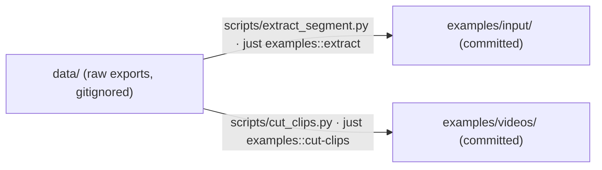

# `data/` — illustrative raw exports (not version controlled)

This directory holds the **raw video-annotation exports** the example corpus was
derived from, kept for provenance and reproducibility.

The data itself is gitignored (downloaded from the
[**TIBAVA** demo instance](https://service.tib.eu/tibava)). The maintainer
scripts that rebuild `examples/input/` and `examples/videos/` live in
[`data/scripts/`](scripts/) and run via `just examples::regenerate`; see
[`examples/README.md`](../examples/README.md) for how the input becomes the
corpus.

`data/scripts/` turns the raw exports into the committed example inputs:



## Where it comes from — the TIBAVA demo instance

Two videos are currently imported: `Silent Child` and `Tagesschau`. Two of
TIBAVA's export modes produce the two halves of each `data/<src>/` folder:

<table>
<tr>
<td width="50%"><strong>Export project → <em>Include video</em></strong> produces <code>raw_data/</code> — the timeline tree, typed plugin results, result blobs, and the source video.</td>
<td width="50%"><strong>Individual CSVs → <em>Use seconds</em></strong> produces the per-track <code>tsv/</code> files (one per timeline node), which the extractor slices into <code>examples/input</code>.</td>
</tr>
<tr>
<td></td>
<td></td>
</tr>
</table>

## Temporary by design

This raw data, and the scripts that turn it into `.mediapkg`
(`data/scripts/extract_segment.py`, `examples/scripts/build_mediapkg.py`,
`data/scripts/cut_clips.py`) are a temporary bridge for developing the format.
The goal is that applications export and import `.mediapkg` directly via the
`mava-exchange` package, at which point this manual raw→mediapkg path is
retired.

The data is also not committed because it is **media / biometric data**:
third-party copyrighted video plus face crops, embeddings, and clustering of
identifiable people.

## Expected layout

The tooling expects one folder per source, matching the two exports above:

```
data/<src>/
  raw_data/                    # from "Export project" (Include video)
    <hash>.mp4                 #   the source video (cut_clips.py reads this)
    video.yml                  #   width, height, fps, duration, file (=<hash>), ext
    timelines.yml              #   the track tree (parent_id, node type) -> hierarchy
    plugin_runs.yml            #   plugin run metadata (derivation methods)
    plugin_run_results.yml     #   typed results (SCALAR, SHOTS, CLUSTER, TYPE_BBOXES, …)
    data/                      #   result blobs (zips) referenced by data_id
  tsv/                         # from "Individual CSVs" (Use seconds)
    <Track Name>.tsv           #   per-track rows, one file per timeline node
```

- **`extract_segment.py`** reads `raw_data/timelines.yml` for the tree and
  `tsv/<Track Name>.tsv` for each track's rows. For `silent_child` it also reads
  the face-box and cluster blobs under `raw_data/data/` to build the
  `RegionSeries`. The per-source window / included tracks / derivation overlay
  live in that script's `SOURCES` table.
- **`cut_clips.py`** reads `raw_data/video.yml` to locate `<hash>.mp4` and cuts
  the demo clip using the `source_window` recorded in
  `examples/input/<src>/video.yml`.

> A source that isn't exported locally is skipped; one that is present but
> missing required pieces (`raw_data/` ymls, `tsv/`, or declared region blobs)
> is a hard error — see `validate_source_layout` in `extract_segment.py`.
